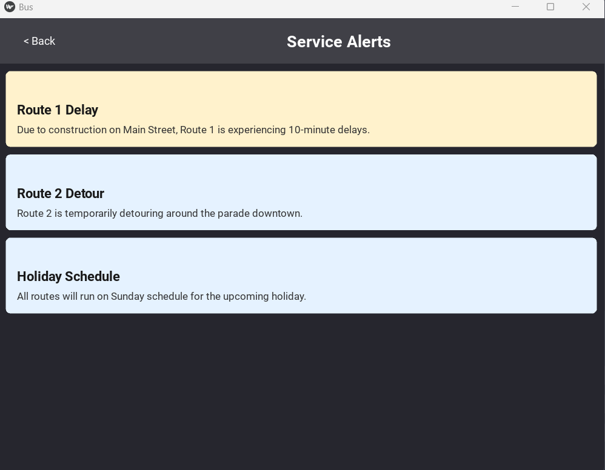
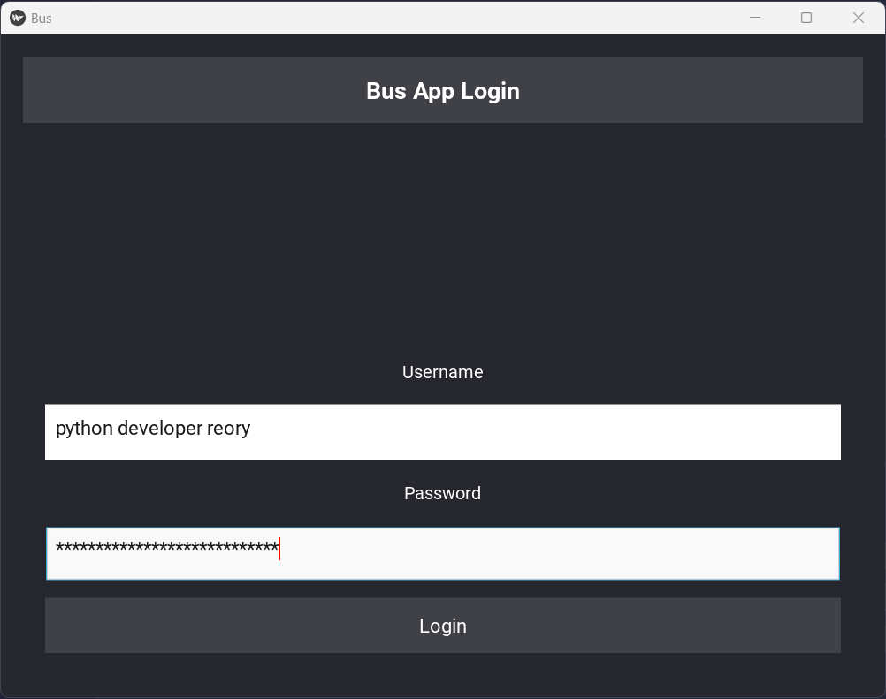
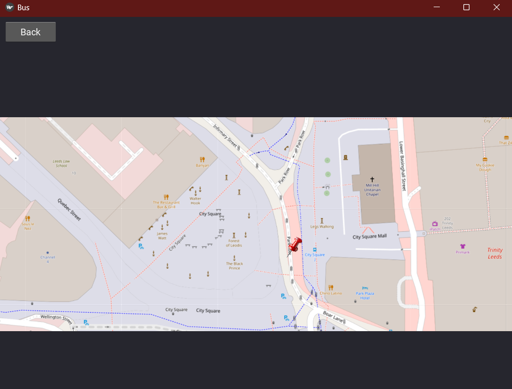
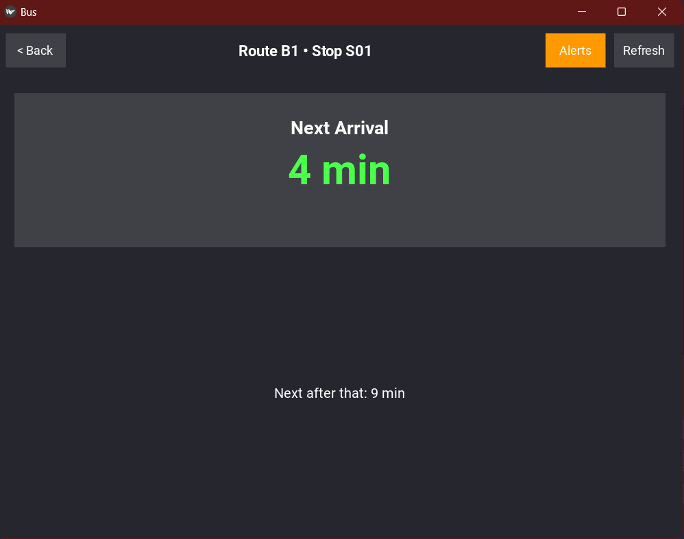
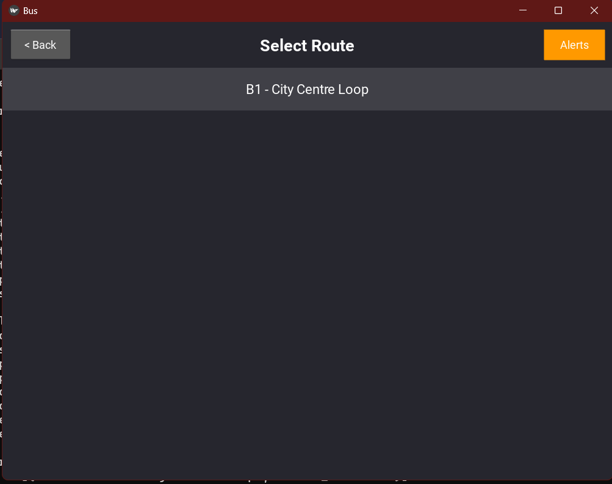
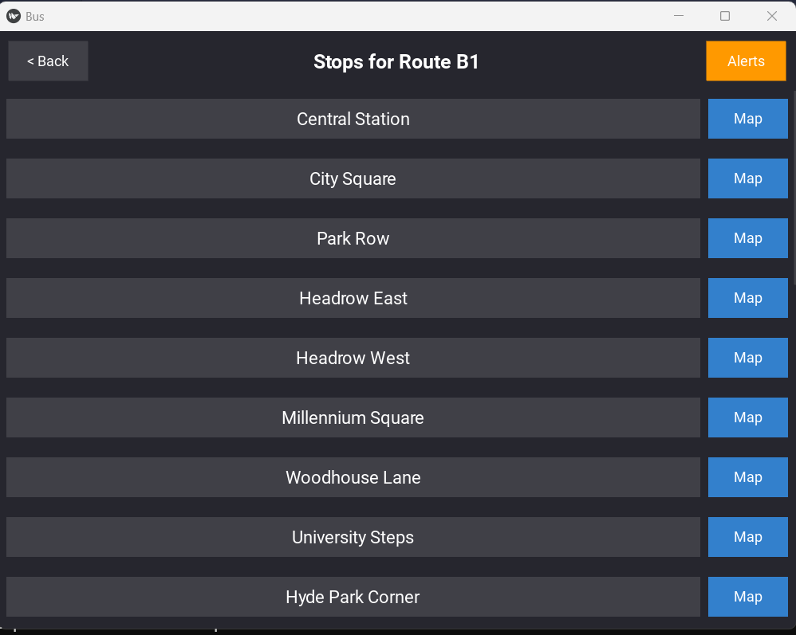

# Bus Tracker


A full-stack transit app featuring a  Django REST framework and a Multi-threaded Kivy mobile interface.

A Reliable transit apps require robust front-end logic. I built this UK Bus Tracker (v1) as a Proof of Concept to demonstrate a mobile-ready UI (Kivy) capable of processing transit data. To ensure a consistent demo experience without API rate-limiting, v1 utilizes a mocked data engine that simulates real-world bus arrivals.

---

## 📱 App Gallery

<p align="center">
  
  
  
  
  
  
</p>

---

## 🚀 Features

* **17/17 Passing Unit Tests**✅ 
* **Mocked Time** - (Proof of concept)
* **Multi-threaded Kivy UI**
* **Django REST Framework Backend** (Scalable app structure)

---

## 📦 Installation

1. **Clone the repository and install:**
```bash
git clone https://github.com/reory/bus_app.git
cd bus_app
pip install -r requirements.txt
python manage.py migrate
```

---

## Usage

This project requires both the backend and frontend to be running simultaneously.

1. **Start the backend:** 
   ```bash
    python manage.py runserver 
    ```

2. **Start the frontend:**
   ```bash
   python main.py
   ```

---

## Project Structure

```text
bus_app/
├── api/                  # Main API Gateway & GTFS Imports
├── bus_backend/          # Project Core
│   ├── apps/             # Modular Business Logic
│   │   ├── notifications/# User alerts & notifications
│   │   ├── realtime/     # Live bus tracking data
│   │   ├── routes/       # GTFS route & stop management
│   │   └── users/        # Custom user models & auth
│   └── settings.py       # Global configuration
├── frontend/             # Kivy Mobile Application
├── tests/                # 17 Unit tests (Backend & Frontend)
├── manage.py             # Django management script
└── main.py               # Kivy entry point
```

---

## Testing🚦

The project includes a comprehensive suite of 17 tests covering models, serializers, and the Kivy UI logic.

To run the tests:
```bash
pytest
```

---

## Technologies Used

- Python 3.x
- Django (REST framework)
- Kivy (UI Framework)
- Pytest (Testing)
- Celery (Task scheduling)

---

## Notes
- Version 1.0 Initial release. 
- 17 passing unit tests. 
- Ensure the Django backend is running before starting the Kivy frontend.

**Built By Roy Peters** [Click here for contact details 😁](https://www.linkedin.com/in/roy-p-74980b382/)